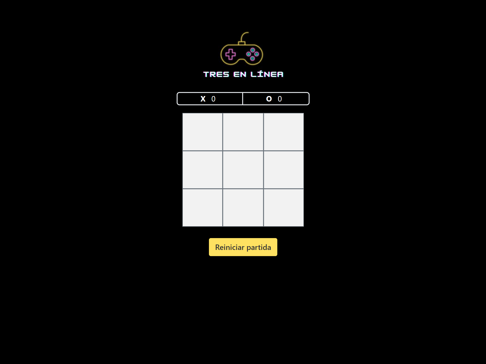

# Tic-Tac-Toe

Un juego clásico de **Tic-tac-toe** (o tres en raya) desarrollado utilizando **HTML**, **CSS**, **JavaScript**, y **Bootstrap 5**. Este proyecto incluye un tablero interactivo, funcionalidad de jugador contra la computadora, y un sistema de puntuación.

## Características

- **Interfaz moderna y responsiva**: Diseñada con Bootstrap 5 para garantizar compatibilidad en diferentes dispositivos.
- **Modo jugador vs computadora**: La computadora tiene tres niveles de dificultad (fácil, medio y difícil).
- **Sistema de puntuación**: Registra las victorias de los jugadores X y O.
- **Animaciones visuales**: Las celdas ganadoras se resaltan con un color distintivo.
- **Botón de reinicio**: Comienza un nuevo juego sin necesidad de recargar la página.

## Capturas de Pantalla

_Interfaz principal del juego_

## Tecnologías Utilizadas

- **HTML5**: Estructura del juego.
- **CSS3**: Estilización personalizada para el tablero y los elementos interactivos.
- **JavaScript**: Lógica del juego y el manejo de eventos.
- **Bootstrap 5**: Sistema de diseño responsivo y estilización adicional.
